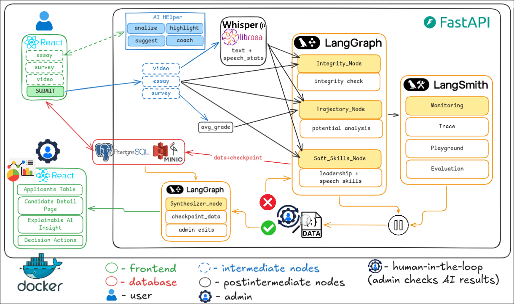

# Intelligent Candidate Selection Support System

Explainable AI microservice for university admissions evaluation, built with
FastAPI, LangGraph, and LangChain.

## Features

- **Parallel AI Analysis** — Essay, trajectory, and integrity checks run concurrently.
- **Human-in-the-Loop** — Graph pauses before final synthesis so an admissions officer can review intermediate results.
- **Explainable Scoring** — Every recommendation includes a narrative explanation citing specific evidence.
- **Clean Architecture** — Strict separation into domain, application, infrastructure, and presentation layers.

## Project Architecture


## Quick Start

```bash
# Copy environment template and set your OpenAI key
cp .env.example .env

# Install dependencies
uv sync

# Run the API
uvicorn app.main:app --reload
```

## Docker

```bash
docker compose up --build
```

The API will be available at `http://localhost:8000`.

## API Endpoints

| Method | Path | Description |
|--------|------|-------------|
| `GET` | `/health` | Health check |
| `POST` | `/api/v1/evaluate` | Start candidate evaluation |
| `POST` | `/api/v1/evaluate/{thread_id}/resume` | Resume after human review |

## Architecture

```
app/
├── domain/          # Pydantic schemas, exceptions (no external deps)
├── application/     # LangGraph state, nodes, graph builder
├── infrastructure/  # LLM client factory, checkpointer factory
└── presentation/    # FastAPI routers, dependency injection
```
